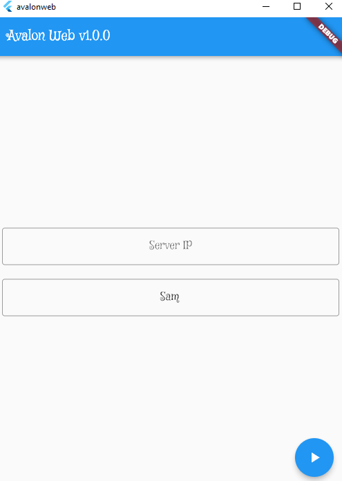
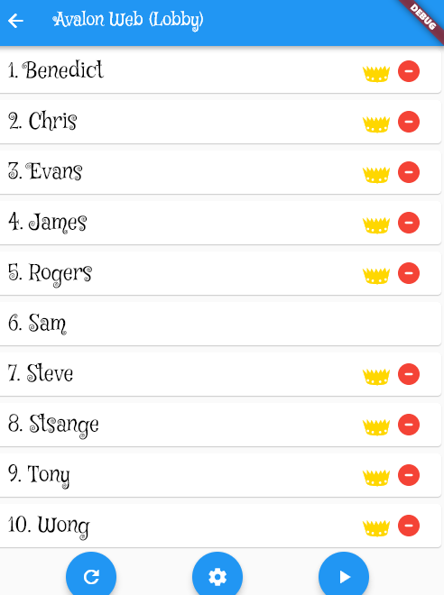
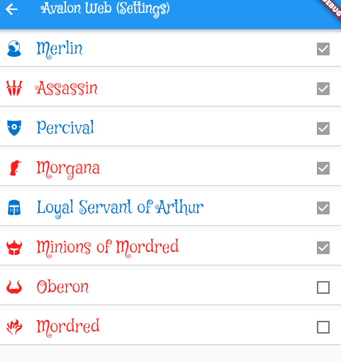
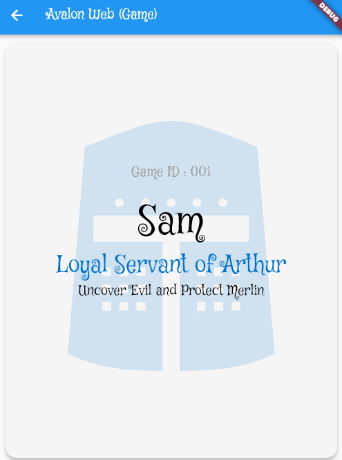
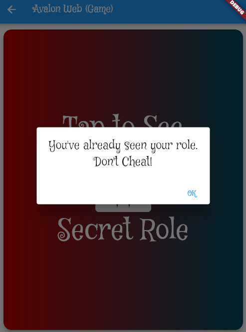
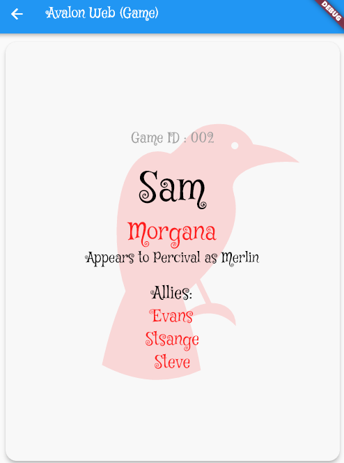
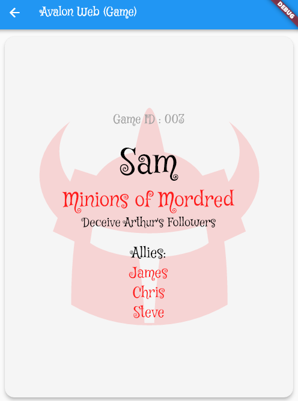
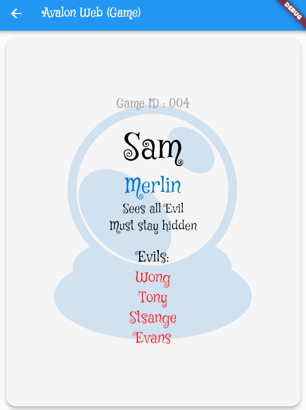

# Avalon Web (Client)

## Notes
1. If Server IP field is blank, auto set to localhost.
2. Only Oberon and Mordred can be activated/deactivated.
3. Players who rolled a power role such as Merlin will not get the same role twice. The player may still roll another power role.
4. Min player is 5. Max is 10.

